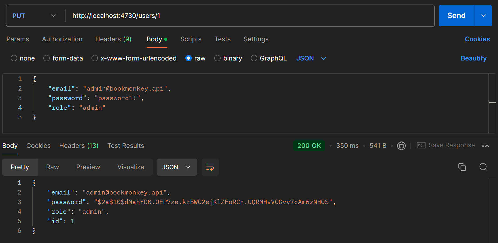

<h1 style="text-align: center;">Web&Ink</h1>

<h2 style="text-align: center;">Building Blocks for Digital Creatives</h2>


Web & Ink brings the bookstore experience to your screen, offering a handpicked selection of web design and development books. 
Explore our virtual shelves from the comfort of your home and craft your next digital masterpiece!

Web&Ink is an online bookstore built with **React** and **TypeScript**, using the [bookmonkey-api on npm](https://www.npmjs.com/package/bookmonkey-api). This project showcases how to manage user roles, CRUD operations, shopping baskets, and overall functionality of a bookstore. It includes a color scheme and functionality changes based on the user role, allowing for both admin and non-admin views, as well as independent shopping baskets for each user. Additionally, I have implemented a **login system** and managed the state using **Redux Toolkit**.

## Features

- **User Roles**: Admins and customers have different functionalities and views.
- **Admin Privileges**: As an admin, you can **Create**, **Read**, **Update**, and **Delete** (CRUD) books.
- **Shopping Baskets**: Each customer has their own independent basket.
- **Dynamic UI**: The color scheme changes depending on the user role.
- **Active Search**: Quickly find books using the integrated search functionality.
- **State Management**: Managed with **Redux Toolkit** and **React Router** for navigation.
- **Login System**: Users can log in to access their roles and functionalities.

---

## Getting Started

Follow these instructions to set up and run the project locally.

### Prerequisites

- Node.js installed on your machine
- A code editor (such as VS Code)
- Postman or cURL for sending requests to the API

### Installation

1. **Clone the repository:**
```bash
git clone https://github.com/your-username/web-and-ink-bookstore.git
cd web-and-ink-bookstore
```

2. **Install project dependencies**
```bash
npm install
```

3. **Download and set up the bookmonkey-api**

The project uses the bookmonkey-api npm package for backend functionality. To download and install it, run:
```bash
npm install -g bookmonkey-api
```
For more details, you can find the official documentation for the BookMonkey API here: [bookmonkey-api](https://www.npmjs.com/package/bookmonkey-api). After installation, you can access the documentation locally at `http://localhost:4730`.

### Running the project

1. **Start the Frontend Application:**

In your main project directory, start the React app with:
```bash
npm start
```
Your app should now be running at `http://localhost:3000`.

2. **Start the BookMonkey API:**

In a separate terminal window, run the following command to start the API:
```bash
bookmonkey-api
```

### Setting up roles

By default, the users in the BookMonkey API do not have any roles. You will need to assign roles before the app can function correctly. Use the roles `"admin"` for admins and `"non-admin"` for customers. You can create as many customers as you want and they will all have separate shopping baskets that will persist through logouts/logins.

There is already one demo-user in the bookmonkey-api database with the following credentials:

- admin@bookmonkey.api
- password1!

This user needs to be assigned a role (`"admin"`) and therefore be updated. In order to be able to log in as a customer, you have to create a new user with the role `"non-admin"` for the database. 

You can either:
- Use Invoke-WebRequest in PowerShell or cURL commands to update the user roles.
- Use Postman to send a PUT request to the API and assign roles to the users.

The example using **PowerShell (Invoke-WebRequest)** to update a user's role to "admin"  ("1" stands for user-id: 1) and create a new customer:
```powershell
Invoke-WebRequest -Uri "http://localhost:4730/users/1" `
>> -Method PUT `
>> -Headers @{"Content-Type"="application/json"} `
>> -Body '{"email":"admin@bookmonkey.api","password":"password1!","role":"admin"}'
```
```powershell
Invoke-WebRequest -Uri "http://localhost:4730/register" `
-Method POST `
-Headers @{"Content-Type"="application/json"} `
-Body '{"email": "customer1@bookmonkey.api", "password": "password1!","role":"non-admin"}'
```
For users who prefer **cURL**, the equivalent commands are:
```bash
curl -X PUT -H "Content-Type: application/json" -d '{"email":"admin@bookmonkey.api","password":"password1!","role":"admin"}' "http://localhost:4730/users/1"
```
```bash
curl -X POST -H "Content-Type: application/json" \
-d '{"email": "customer1@bookmonkey.api", "password": "password1!","role":"non-admin"}' \
"http://localhost:4730/register"
```
**OR** you can use **Postman** to update the roles: 


<div style="display: flex; align-items: center;">
    
    
</div>
<br>
Once roles are assigned and you log in, the app will adapt its functionality and UI based on the role. Admins have access to CRUD features, and the color scheme changes depending on the user role. Non-admin users (customers) have the capability to add books to their shopping basket, which will persist even after logging out, and they are also able to proceed with the checkout process.

### Admin view

<div style="display: flex; align-items: center;">
    
    
</div>

### Customer view

<div style="display: flex; align-items: center;">
    
    
</div>

### License

This project is licensed under the MIT License. See the [MIT License](https://opensource.org/licenses/MIT) for details.